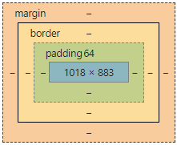

# Box model

Allt i CSS har en låda omkring sig, därför är det centralt att förstå hur detta fungerar för att kunna skapa layout med CSS. Se Fig 1.



## Vad är box model

Förenklat är det hur mycket plats element tar på en webbsida, hur stort det är. Men hur detta räknas ut och påverkas av andra element är komplicerat. Elementets box model är uppdelad i flera olika delar, se fig 1. Elementets storlek är summan av alla delarna.

### Content

De/det element eller innehåll\(engelska content\) som finns i elementet. Innehållet styr elementets storlek.



```markup
<div>
    <p>Den omgivande divens storlek är beroende av den här textens storlek.</p>
    <p>Men p-elementen styrs också av box model för sin storlek.
</div>
```



### Padding

Runt elementets innehåll finns det en padding på alla sidor. Denna padding är tomt utrymme som skapar luft runt elementets innehåll.



```markup
<div class="w-100 p-5">
    <p>I det här exemplet styr vi div-elementets storlek med klassen w-100.
    Utöver det så sätts en padding med p-5, detta kommer ställa till problem.
    </p>
</div>
```



```css
.w-100 {
    width: 100%;
}

.p-5 {
    padding: 5rem;
}
```



För att räkna ut div-elementets bredd i exemplet här ovan så räknar vi ihop elementets storlek + padding. Det blir 100% + 5rem \* 2. Paddingen på sidan om elementet dubblas eftersom den finns på båda sidorna. 5 rem är med standardstorleken 16px alltså 80px, detta dubblas och elementets storlek blir 100% av parent + 160px, något som med största sannolikhet resulterar i att elementet är bredare än önskat.

### Border

Om elementet har en ram så läggs även det till i elementets storlek.



```markup
<div class="border">
    <p>Div-elementets kommer ligga nägra denna text och det kommer vara styrt
     av textens storlek. Elementets storlek kommer att vara div + border. Kom 
     ihåg att även borderns storlek dubblas.
     </p>
</div>
```



```css
.border {
    border: 1px solid black;
}
```



### Margin

Runt elementet finns slutligen en marginal som omger elementet. Detta fungerar liknande padding, men är utanför elementet och inte innanför. Måttet dubblas även det och läggs på padding och border.



```markup
<div class="news border">
    <p>Some content.</p>
</div>
```



```css
.news {
    width: 40rem;
    margin: 0 2rem;
    padding: 1rem;
}

.border {
    border: 1px solid black;
}
```



För att räkna ut div-elementets bredd från exemplet ovan så tar vi, content + padding \* 2 + border \* 2 + margin \* 2. Det blir alltså \(40 \* 16\) + \(1 + 1\) \* 16  + 2 + \(2 + 2\) \* 16 = 738px.

Testa att räkna ut höjden och använd utvecklarverktygen i en webbläsare för att se uträknad\(engelska computed\) höjd och bredd.

## Block och inline-element

Se avsnittet från HTML-kapitlet, [Block och inline-element](../html/html-spraket.md#block-och-inline-element).

## Display typer

## Läs mer

* [https://developer.mozilla.org/en-US/docs/Learn/CSS/Building\_blocks/The\_box\_model](https://developer.mozilla.org/en-US/docs/Learn/CSS/Building_blocks/The_box_model)

