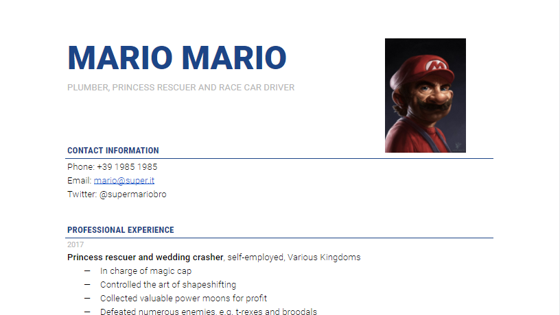

# Layout

## CV, en första design

För att skapa en sida med ett CV så är det i första hand en fråga om att märka upp text. När detta är gjort och en struktur har skapats finns det utrymme att arbeta vidare med att skapa en personlig stil. Det CV som skapas i detta exempel är ett CV för en fiktiv karaktär.


Börja med att identifiera webbsidans komponenter och struktur.




Strukturmässigt så kan vi dela upp det i följande element.

* `header`, bestånde av rubrik, kontaktuppgifter och porträtt
* `main`
  * `section`, med rubrik, tidsangivelse och resume.
  * efterföljande sektioner

Elementen kan även märkas upp med ID för sektionerna för att möjliggöra fragments-navigation. Navigation, hypertext, är en möjlig förbättring vi kan göra av sidan för att utnyttja webbsidans styrkor. Kodad med HTML-element kan första delen se ut såhär. 

#### Uppgift

Koda resten av CV sidan. Texten hittar du i engelska-uppgiften. När du är klar så kan du jämföra ditt resultat med det [här](https://raw.githubusercontent.com/jensnti/Webbutveckling/1c9b95925e22827d8be32e8e4e620f53dda991ec/exempel/cv.html).


```markup
<!DOCTYPE html>
<html lang="en">
<head>
  <meta charset="UTF-8">
  <meta name="viewport" content="width=device-width, initial-scale=1.0">
  <title>CV - Mario Mario</title>
</head>
<body>
  <header id="contact">
    
    <h1>Mario Mario</h1>
    <h2>Plumber, princess rescuer and race car driver</h2>
    <h3>Contact Information</h3>
    <address>
      Phone: +39 1985 1985
      Email: mario@super.it
      Twitter: @supermariobro
    </address>
  </header>
  <main id="professionalexperience">
    <h1>Professional experience</h1>
    <section id="twentyseventeen">
      <h2><time datetime="2017">2017</time></h2>
      <p><strong>Princess rescuer and wedding crasher</strong>, self-employed, Various Kingdoms</p>
      <ul>
        <li>In charge of magic cap</li>
        <li>Controlled the art of shapeshifting</li>
        <li>Collected valuable power moons for profit</li>
        <li>Defeated numerous enemies, e.g. t-rexes and broodals</li>
      </ul>
    </section>
```


### Länka ett CSS dokument

För att länka ett extern CSS dokument så behövs en länk i sidans head-element. Skapa cv.css.


```markup
<link rel="stylesheet" href="cv.css">
```


Sidan läser nu in stilarna från det externa css-dokumentet.

### Layout med CSS

Marios CV har en relativt enkelt struktur, det är en kolumns layout uppdelat i en `header` och en `main` för innehållet. Strukturen med dessa element och underliggande skapar vi för att gruppera sidans delar.

Sidan är en kolumn som är centrerad. Detta kan vi göra genom att justera sidans bredd och marginaler.


```css
body {
    margin: 0 auto;
    width: 60%;
}
```


Headern innehåller porträttet, namn-rubriken och kontaktinformation med tillhörande rubriknivåer. För att placera bilden kan vi använda egenskapen `float`. Skapa en klass för detta och koppla den till elementet.




```markup
  <header id="contact">
    
    <h1>Mario Mario</h1>
    <h2>Plumber, princess rescuer and race car driver</h2>
    <h3>Contact Information</h3>
    <address>
      Phone: +39 1985 1985
      Email: mario@super.it
      Twitter: @supermariobro
    </address>
  </header>
```





```css
.portrait {
    float: right;
}
```




Ladda om sidan och bilden placeras nu till höger om texten, texten anpassar sig även till bildens storlek. 


Float fungerar bra i vissa upplösningar, om du ändrar storleken på webbläsarfönstret till att vara riktigt smalt så kan du se att float får problem.


Den andra delen av sidan är samlad i ett `main` element, den innehåller huvuddelen av CV-informationen. Under detta är varje del strukturerad i en `section` med tillhörande rubrik. Marios färdigheter och erfarenheter är sedan strukturerad i en o-ordnad lista, `ul`.


```markup
  <main id="professionalexperience">
    <h1>Professional experience</h1>
    <section id="twentyseventeen">
      <h2><time datetime="2017">2017</time></h2>
      <p><strong>Princess rescuer and wedding crasher</strong>, self-employed, Various Kingdoms</p>
      <ul>
        <li>In charge of magic cap</li>
        <li>Controlled the art of shapeshifting</li>
        <li>Collected valuable power moons for profit</li>
        <li>Defeated numerous enemies, e.g. t-rexes and broodals</li>
      </ul>
    </section>
```


### Typsnitt

Typsnittet som används på Mario sidan är en så kallad sans-seriff. En seriff är klacken på ett tecken och sans betyder utan, så utan klack. 


[Läs mer här om vad en seriff är.](https://sv.wikipedia.org/wiki/Seriff)


**Visual Studio Code** ger ett antal förslag och exempel på fonter som kan användas när css-egenskpen `font-family` anges. Egenskapen tar en eller flera fonter som värde, där den provar den första om den fungerar, den andra och så vidare.



```css
body {
    font-family: Arial, Helvetica, sans-serif;
}
```



#### Egna fonter

Att använda de föreslagna fonterna fungerar självklart utmärkt, men för ett mer personligt uttryck för Mario så används en extern font från Google fonts. För att använda en font därifrån behöver du:

1. Leta reda på en font du vill använda.
2. Klicka på den.
3. På fontens sida väljer du **+ Select this style**.
   1. Välj **Regular 400** om du inte har andra behov.
4. I sidebaren med **Selected family**.
5. Klicka på **Embed**.
6. Kopiera länken till ditt html dokuemnt.
7. Kopiera CSS egenskapen font-family till ditt CSS dokument.

Marios CV får Google fonten Roboto. Följande ändringar görs.




```markup
<link href="https://fonts.googleapis.com/css2?family=Roboto&display=swap" rel="stylesheet">
```





```css
body {
    font-family: 'Roboto', sans-serif;
}
```





Google fonts är ett enormt bibliotek av gratis fonter du kan använda i dina projekt.


## 


## Länkar

* Flexbox
  * [https://www.internetingishard.com/html-and-css/flexbox/](https://www.internetingishard.com/html-and-css/flexbox/)
  * [https://developer.mozilla.org/en-US/docs/Web/CSS/CSS\_Flexible\_Box\_Layout/Basic\_Concepts\_of\_Flexbox](https://developer.mozilla.org/en-US/docs/Web/CSS/CSS_Flexible_Box_Layout/Basic_Concepts_of_Flexbox)
* Layout
  * [https://www.w3schools.com/css/css\_templates.asp](https://www.w3schools.com/css/css_templates.asp)
  * [https://developer.mozilla.org/en-US/docs/Learn/CSS/CSS\_layout](https://developer.mozilla.org/en-US/docs/Learn/CSS/CSS_layout)


