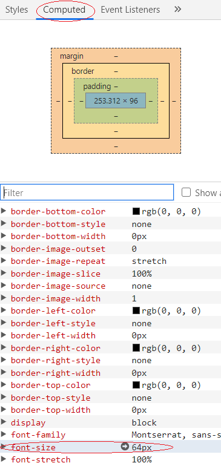

# Mått och värden

## Pixlar

Måttenheten px i CSS anger måttet i pixlar. Måttenheten är statisk och exakt.



```css
img {
    width: 32px;
    height: 32px;
}

html {
    font-size: 16px;
}

h1 {
    border-bottom: 1px solid gray;
}
```



## Procent

I många fall så används procent som måttenhet i CSS, det kan till exempel vara för att ange att ett element ska vara 100% brett eller 60% av ett fönsters bredd.



```css
.h-100 {
    height: 100%;
}

.w-100 {
    width: 100%;
}

main {
    width: 80%;
    margin: 0 auto;
}
```



Undvik procent när du skalar text till exempel, då det ger dig väldigt lite kontroll över hur faktiskt stor texten blir.

## Root EM

REM är ett måttvärde i CSS. Det utgår från root elementets font-storlek för att sätta storleken på element.

Värdet skrivs som nedan för att till exempel sätta storleken på texten och det kommer utgå från HTML-elementets textstorlek, vilket som oftast är 16px.



```css
p {
    font-size: 1rem;
}
```



Om du anger detta på en sida så kan du sedan inspektera uträknade värden i webbläsarens utvecklingsverktyg. Se Fig 1.



Försök i största möjliga mån använda REM som måttenhet då det tillåter användaren att ändra fontstorlek, till skillnad från pixlar.

För att räkna ut storleken i pixlar från rem så kan du använda pixlar \* rem = faktisk storlek i pixlar, så om du använder 0.5rem så blir storleken 8px. Om du vet pixelstorleken och vill räkna ut storleken i rem använder du storlek i pixlar / 16 = rem.

