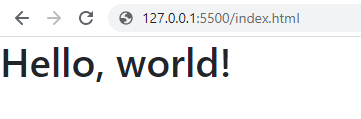

# Bootstrap


Detta dokument är skrivet utifrån version 4.5 av Bootstrap.


## Vad och varför

Bootstrap är enligt dem själva världens populäraste front-end ramverk. Det är ett robust system för att snabbt designa sidor, eller prototyper för sidor. Designen landar definitivt i kategorin stilrent och enkelt, med det är en bra grund att utgå ifrån.

Bootstrap är även byggt med en stor samling **agenter** \(engelska **devices**\) i åtanke, så det hjälper mobilanpassningen av webbsidan.

I version 4 och tidigare har Bootstrap använt javascript-ramverket [**jQuery**](https://jquery.com/), detta har varit på gott och ont. Från version 5 kommer Bootstrap inte längre använda jQuery.


[jQuery ](https://jquery.com/)är ett otroligt populärt javascript-ramverk för att förenkla arbetet med webbsidor.


## Hur


Bootstrap finns på [https://getbootstrap.com/](https://getbootstrap.com/).


För att inkludera Bootstrap på en webbsida kan du använda deras startertemplat. Den innehåller css filen samt det javascript som behövs för att det ska fungera.



```markup
<!doctype html>
<html lang="en">
  <head>
    <!-- Required meta tags -->
    <meta charset="utf-8">
    <meta name="viewport" content="width=device-width, initial-scale=1, shrink-to-fit=no">

    <!-- Bootstrap CSS -->
    <link rel="stylesheet" href="https://stackpath.bootstrapcdn.com/bootstrap/4.5.2/css/bootstrap.min.css" integrity="sha384-JcKb8q3iqJ61gNV9KGb8thSsNjpSL0n8PARn9HuZOnIxN0hoP+VmmDGMN5t9UJ0Z" crossorigin="anonymous">

    <title>Hello, world!</title>
  </head>
  <body>
    <h1>Hello, world!</h1>

    <!-- Optional JavaScript -->
    <!-- jQuery first, then Popper.js, then Bootstrap JS -->
    <script src="https://code.jquery.com/jquery-3.5.1.slim.min.js" integrity="sha384-DfXdz2htPH0lsSSs5nCTpuj/zy4C+OGpamoFVy38MVBnE+IbbVYUew+OrCXaRkfj" crossorigin="anonymous"></script>
    <script src="https://cdn.jsdelivr.net/npm/popper.js@1.16.1/dist/umd/popper.min.js" integrity="sha384-9/reFTGAW83EW2RDu2S0VKaIzap3H66lZH81PoYlFhbGU+6BZp6G7niu735Sk7lN" crossorigin="anonymous"></script>
    <script src="https://stackpath.bootstrapcdn.com/bootstrap/4.5.2/js/bootstrap.min.js" integrity="sha384-B4gt1jrGC7Jh4AgTPSdUtOBvfO8shuf57BaghqFfPlYxofvL8/KUEfYiJOMMV+rV" crossorigin="anonymous"></script>
  </body>
</html>
```



Exemplet ovan ger en Hello world templat, stilarna laddas in men ytterst lite av Bootstraps faktiska funktion används.



## Dokumentation

Det mesta i det här dokumentet är hämtat ur Bootstraps dokumentation. Lär dig använda och söka i den.


[https://getbootstrap.com/docs/4.5/getting-started/introduction/](https://getbootstrap.com/docs/4.5/getting-started/introduction/)


## Innehåll, komponenter och verktyg

Styrkan i Bootstrap ligger i att använda dess komponenter och i att förstå hur det fungerar tillsammans. Allt sköts med CSS-klasser.  Klasserna används tillsammans ur de olika kategorierna för att skapa en layout.

### Layout

Bootstrap skapar webbsidans layout med ett **rutsystem**\(engelska **grid**\). Systemet bygger på att använda **behållare**\(engelska **containers**\) som i sin tur kan innehålla rader och kolumner. För att skapa en behållare så används css klassen .container. Containers är kärnan i systemet.



```markup
<div class="container">
  <!-- Content here -->
</div>
```



Container klassen finns i flera varianter utifrån responsiva-brytpunkter för att passa olika skärmstorlekar. Läs mer om hur det fungerar [**här**](https://getbootstrap.com/docs/4.5/layout/overview/).

### Rutsystemet

I Bootstraps containers kan sedan rader och kolumner skapas utifrån det inbyggda rutsystemet. Detta är starkt kopplat till skrämstorlekar och responsiva-brytpunkter, så det är viktigt att förstå den delen. Läs mer om detta [**här**](https://getbootstrap.com/docs/4.5/layout/grid/).

### Innehåll

En del av Bootstraps stilar hanterar formatteringen av webbsidans innehåll. Från typsnitt till bilder.

### Komponenter

 Bootstrap innehåller ett stort antal färdiga komponenter att använda på webbsidor. Till exempel

* Navigation
* Knappar
* Karusell
* Kort
* Formulär
* Modals

Listan är väldigt lång så titta på [dokumentationen](https://getbootstrap.com/docs/4.5/components/). Utgå från vad webbplatsen och designen behöver. Leta upp exempel, kopiera koden och börja redigera. 

### Verktyg 

När du börjar bli något mer förtrogen med hur Bootstrap fungerar så kommer du att upptäcka alla hjälpklasser det innehåller. Det är en av de stora styrkorna med systemet och något som du med största sannolikhet kommer att börja reproducera när du skriver egen CSS. Nästan alla webbsidor du skapar kommer att ha behov av klasser för **marginal**, **padding** och **flexbox**. Att då skapa en hjälpklass istället för att upprepa samma kod om och om igen är god praxis. Jämför följande exempel.



```css
.nav {
  display: flex;
  font-size: 2em;
  background-color: darkgrey;
}

.main {
  display: flex;
}

.footer {
  display: flex;
  background-color: darkgrey;
}
```



```css
.d-flex {
  display: flex;
}

.bg-dark {
  background-color: darkgrey;
}
```



Hjälpklasserna används sedan där till exempel display flex behövs, eller en gemensam bakgrundsfärg ska sättas.



```markup
<nav class="d-flex bg-dark">
  <!-- Content -->
</nav>
<main class="d-flex">
  <!-- Content -->
</main>
```



I det ovanstående exemplet finns css-klasserna med för att illustrera funktionen. Bootstrap har dock dessa hjälpklasser med samma namn färdiga att använda. Som med komponenterna är det bäst att kolla igenom den officiella [dokumentationen](https://getbootstrap.com/docs/4.5/utilities/).

Några av de riktigt användbara delarna följer:

* [Colors](https://getbootstrap.com/docs/4.5/utilities/colors/)
  * Bootstrap har ett antal förinställda färger att använda.
* [Flex](https://getbootstrap.com/docs/4.5/utilities/flex/)
  * Få saker är så användbara som flex-klasserna för att skapa en layout och positionera element.
* [Spacing](https://getbootstrap.com/docs/4.5/utilities/spacing/)
  * Allt du behöver för att skapa **marginaler**\(engelska **margin**\) och **fyllnad**\(engelska **padding**\).
* [Text](https://getbootstrap.com/docs/4.5/utilities/text/)
  * Klasser för att kontrollera text. Detta är komplement till [innehålls klasserna för typografi](https://getbootstrap.com/docs/4.5/content/typography/).

### Exempel

Nedan följer ett modifierat [exempel](https://getbootstrap.com/docs/4.5/examples/blog/) från Bootstraps sida för att skapa en blogg-post. Notera användningen av en container, rader\(med padding top\) och kolumn. De flesta elementen får Bootstraps grund-stilar, men ett par kompletterande klasser har skapats.



```markup
<main class="container">
  <div class="row pt-3">
    <div class="col">
      <div class="blog-post">
        <h2 class="blog-post-title">Sample blog post</h2>
        <p class="blog-post-meta">January 1, 2014 by <a href="#">Mark</a></p>

        <p>This blog post shows a few different types of content that’s supported and styled with Bootstrap.
          Basic typography, images, and code are all supported.</p>
        <hr>
        <p>Cum sociis natoque penatibus et magnis <a href="#">dis parturient montes</a>, nascetur ridiculus
          mus. Aenean eu leo quam. Pellentesque ornare sem lacinia quam venenatis vestibulum. Sed posuere
          consectetur est at lobortis. Cras mattis consectetur purus sit amet fermentum.</p>
        <h2>Heading</h2>
        <p>Vivamus sagittis lacus vel augue laoreet rutrum faucibus dolor auctor. Duis mollis, est non
          commodo luctus, nisi erat porttitor ligula, eget lacinia odio sem nec elit. Morbi leo risus,
          porta ac consectetur ac, vestibulum at eros.</p>
        <h3>Sub-heading</h3>
        <p>Cum sociis natoque penatibus et magnis dis parturient montes, nascetur ridiculus mus. Aenean
          lacinia bibendum nulla sed consectetur. Etiam porta sem malesuada magna mollis euismod. Fusce
          dapibus, tellus ac cursus commodo, tortor mauris condimentum nibh, ut fermentum massa justo sit
          amet risus.</p>
        <ul>
          <li>Praesent commodo cursus magna, vel scelerisque nisl consectetur et.</li>
          <li>Donec id elit non mi porta gravida at eget metus.</li>
          <li>Nulla vitae elit libero, a pharetra augue.</li>
        </ul>
      </div><!-- /.blog-post -->
    </div>
  </div>
</main>
```



```css
/*
 * Blog posts
 */
.blog-post {
  margin-bottom: 4rem;
}
.blog-post-title {
  margin-bottom: .25rem;
  font-size: 2.5rem;
}
.blog-post-meta {
  margin-bottom: 1.25rem;
  color: #999;
}
```



## Testa


Bootstrap kan i början kännas väldigt överväldigande på grund av alla dess klasser. Men det finns ett system och det kommer att visa sig desto mer du använder det.


Att använda Bootstrap och att förstå dess funktion kräver att du arbeta med systemet och provar det. En bra start är just [dokumentationen](https://getbootstrap.com/docs/4.5/getting-started/introduction/) och att börja prova några komponenter. Det finns även en  [exempelsid](https://getbootstrap.com/docs/4.5/examples/), där hittar du ett antal sidor och kombinationer av komponenter för att komma igång. De exempel som finns kan även inspirera, men försök alltid att förstå delarna och var noga med att undersöka om Bootstraps grund har utökats med extra css.

## Övningsuppgift

Välj en trycksak med en intressant layout och försök återskapa den med Bootstrap.

