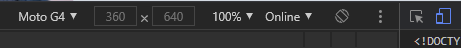
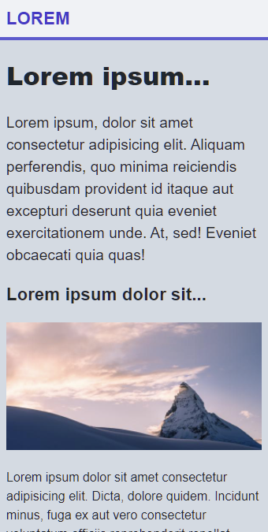
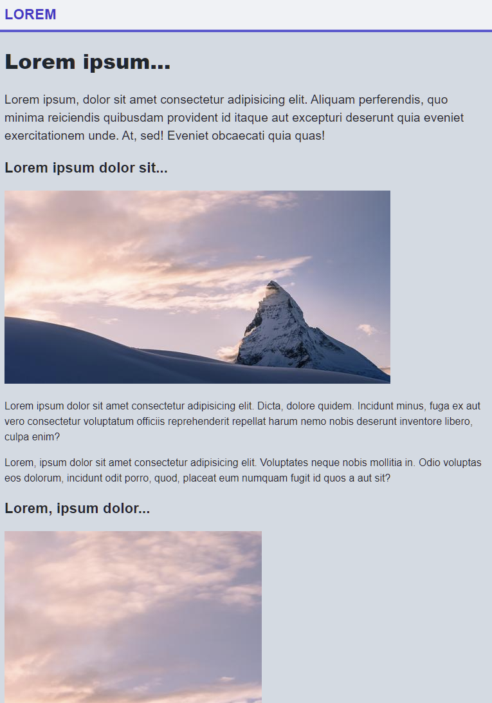
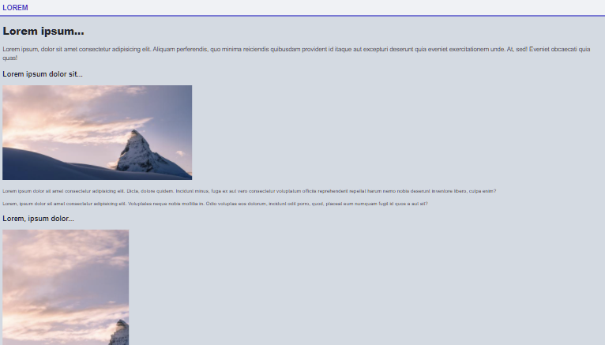

# Responsiv design

Webben består idag av så otroligt många olika **enheter**\(engelska **devices**\) ****att det inte längre är hållbart att bara skapa en sida som fungerar för desktop-upplösning. **Responsiv webbdesign** \(engelska **Responsive Web Design**, **RWD**\) är ett koncept som handlar om att skapa en praxis för utvecklingen av webbsidor som fungerar på många olika enheter. Där det som skiljer enheterna är skärmstorleken och upplösningen.

## Mediaregler

Det främsta verktyget för att skapa en responsiv design är att använda **media regler**\(engelska och CSS, **media queries**\). Media-regler är en del av CSS som gör det möjligt att ange olika regler baserat på enhetens storlek och typ.

### Syntax



```css
@media MEDIATYPE and (condition: breakpoint) {
  // CSS regler
}
```



### Media typer

* all - för alla olika former av media
* print - enbart för skrivare
* screen - för skärmar, det kan vara dator eller telefoner och så vidare
* speech - för skärmläsare

### Breakpoints

Här nedan följer några exempel på vanliga **brytpunkter**\(engelska **breakpoints\)** baserat på pixel-bredd.

* 320px — 480px: Mobile devices
* 481px — 768px: iPads, Tablets
* 769px — 1024px: Small screens, laptops
* 1025px — 1200px: Desktops, large screens
* 1201px and more —  Extra large screens, TV


Det populära ramverket [Bootstrap ](https://getbootstrap.com/docs/5.0/layout/breakpoints/)använder följande dimensioner för att specificera sina breakpoints.

* X-Small &lt; 576px
* Small ≥ 576px
* Medium ≥ 768px
* Large ≥ 992px
* Extra large ≥ 1200px
* Extra extra large ≥ 1400px

## Meta viewport

En responsiv webbsida behöver följande kod i head elementet. Detta berättar berättar för webbläsaren hur dokumentet ska skalas och det behövs för att sidan ska fungera som menat.



```markup
<meta name="viewport" content="width=device-width,initial-scale=1">
```



## Responsiva bilder

Var noga med att anpassa bildstorleken genom att redigera den. CSS får aldrig ersätta anpassningen av bildens upplösning. Den anpassade bilden behöver sedan CSS-regler för att få den att fungera på sidan.



```css
img {
  max-width: 100%;
} 
```



## Responsiv typografi

Textstorlek angiven i procent är inget som rekommenderas eller fungerar särskilt bra. Istället så bör du skapa media-regler som byter textens storlek vid vissa breakpoints. Här är ledordet prova dig fram, [typografi på webben](https://www.smashingmagazine.com/2014/09/balancing-line-length-font-size-responsive-web-design/) är komplext.

## Exempel

En exempel-sida designad utifrån devisen **mobil först** \(engelska **mobile first**\). Här har webbläsarens utvecklarverktyg använts för att skala om fönstret för en mobil upplösning.



### Mobil 340px



Sidan ger 100 för accessibility score i [Lighthouse ](https://developers.google.com/web/tools/lighthouse)med bra performance. Funktionsmässigt fungerar det bra i mobil läget. Eftersom sidan är designad för mobile först så är det att förvänta. Nästa steg blir att anpassa den för andra enheter och skärmstorlekar.




```markup
<!DOCTYPE html>
<html lang="en" class="h-100">
<head>
  <meta charset="UTF-8">
  <meta http-equiv="X-UA-Compatible" content="IE=edge">
  <meta name="viewport" content="width=device-width, initial-scale=1.0">
  <title>RWD</title>
  <link rel="stylesheet" href="style.css">
</head>
<body class="h-100 flex flex-column">
  <nav>
    <div class="navbar container flex align-center">
      <a class="brand" href="#">Lorem</a>
    </div>
  </nav>
  <main class="container">
    <header class="w-100">
      <h1>Lorem ipsum...</h1>
      <p class="lead">Lorem ipsum, dolor sit amet consectetur adipisicing elit. Aliquam perferendis, quo minima reiciendis quibusdam provident id itaque aut excepturi deserunt quia eveniet exercitationem unde. At, sed! Eveniet obcaecati quia quas!</p>
    </header>
    <section>
      <h2>Lorem ipsum dolor sit...</h2>
      
      <p>Lorem ipsum dolor sit amet consectetur adipisicing elit. Dicta, dolore quidem. Incidunt minus, fuga ex aut vero consectetur voluptatum officiis reprehenderit repellat harum nemo nobis deserunt inventore libero, culpa enim?</p>
      <p>Lorem, ipsum dolor sit amet consectetur adipisicing elit. Voluptates neque nobis mollitia in. Odio voluptas eos dolorum, incidunt odit porro, quod, placeat eum numquam fugit id quos a aut sit?</p>
      <h2>Lorem, ipsum dolor...</h2>
      
      <p>Lorem, ipsum dolor sit amet consectetur adipisicing elit. Porro cumque commodi amet fuga sed corporis praesentium, magni, inventore harum illo libero excepturi, tempora mollitia possimus eveniet rerum nulla! Maxime, ipsam!</p>
      <p>Lorem ipsum dolor sit amet consectetur, adipisicing elit. Tenetur aliquam cupiditate exercitationem at sed ipsa, repudiandae est harum laboriosam nam nemo excepturi! Vero quisquam, ea officia atque molestiae cupiditate cum.</p>  
    </section>
  </main>
  <footer>
    <p class="text-center">
      <a href="#">Responsive Web Design</a>
    </p>
    <p class="text-center">© RWD</p>
  </footer>
</body>
</html>
```





```css
/* elements */
body {
  font-size: 1rem;
  line-height: 1.5;
  font-family: Arial, Helvetica, sans-serif;
  background-color: #d2dae2;
  color: #1e272e;
  margin: 0;
}

img {
  height: auto;
  max-width: 100%;
} 

a {
  text-decoration: none;
  color: #3c40c6
}

a:hover {
  text-decoration: underline;
}

h1 {
  font-size: 2rem;
  font-weight: 800;
}

h2 {
  font-size: 1.4rem;
  font-weight: 600;
}

nav {
  border-bottom: 4px solid #575fcf;
  background-color: #eff2f5;
  font-size: 1.4rem;
  font-weight: 600;
}

footer {
  margin-top: auto;
  background-color: #485460;
  color: #eff2f5;
  padding-top: 1.4rem;
  padding-bottom: 2rem;
}

footer > p > a {
  background-color: inherit;
  color: inherit;
  font-weight: 600;
  text-decoration: none;
}

/* classes */
.container {
  margin-left: auto;
  margin-right: auto;
  padding-left: .5rem;
  padding-right: .5rem;
}

.lead {
  font-size: 1.2rem;
}

.brand {
  text-transform: uppercase;
}

.navbar {
  min-height: 48px
}

/* helpers */
.h-100 {
  height: 100%;
}
.w-100 {
  width: 100%;
}

.flex {
  display: flex;
}

.align-center {
  align-items: center;
}

.justify-between {
  justify-content: space-between;
}

.flex-column {
  flex-direction: column;
}

.text-center {
  text-align: center;
}
```




### Desktop 768px

Nästa steg är att öka skärmens storlek och studera resultatet. Det mesta fungerar helt okej, men det är tydligt att bildernas upplösning och ratio gör att linjeringen på sidans högra sida blir väldigt hackig. Detta är något som förstärks mer och mer desto bredare sidan blir. Sidans marginal är nu väldigt liten och radlängden i längsta laget \(bör vara runt [40-75 tecken](https://www.smashingmagazine.com/2014/09/balancing-line-length-font-size-responsive-web-design/)\).



Detta blir alltså det första fokuset att arbeta med. Media regler för marginal, text och bilder. Ingen ändring ska göras i HTML koden.




```css
/* Small devices (tablets, 768px and up) */
@media screen and (min-width: 768px) {
  body {
    font-size: 1.2rem;
  }
  h1 {
    font-size: 3rem;
  }
  h2 {
    font-size: 2rem;
  }
  .lead {
    font-size: 1.4rem;
  }
  .container {
    max-width: 540px;
  }
}
```




Bildstorleken åtgärdas med att sätta en max-width på innehållets container klass. Innehållet centreras och läsbarheten på texten består. Centreringen och fyllnaden sköts av klassens grundegenskaper. Textens storlek justeras för att vara något större.

### Desktop 1200px



Som skärmdumpen visar så är nu sidan svårläst och ful. Det är väldigt tydligt att den mobila designen inte lämpar sig på en dator med webbläsaren i helskärm. Med reglerna på plats för medium-stora skärmar så förbättras sidans utseende något, men det kan fortfarande förbättras. Det som kanske sticker ut mest är att den blir lite för smal och att bilderna inte passar.

Vi kan prova att åtgärda detta med float på bilderna, men ett annat alternativ är att fördela texten i två spalter. Prova det ena eller det andra. 




```css
/* Large devices (large desktops, 1200px and up) */
@media screen and (min-width: 1200px) {
  .container {
    max-width: 960px;
  }
  section {
    column-count: 2;
  }
  /* img {
    float: right;
    margin: 1rem;
  } */
}
```




Slutligen uppmanas du att testa sidan, justera storlekar och marginaler tills det ser bra ut och känns rätt. Det kan behövas fler media-regler för att det ska bli riktigt bra.

### Navigation

Exempelsidans navigation är väldigt enkel då den bara innehåller en brand länk. Just navigationen är ett stort område inom mobil first då navigation ofta tar mycket plats. Detta har lett till ett otal olika menytyper, mest känd är hamburgaren.

Kolla mer kring navigationen på övnings-sidan, där finns det tre olika exempel som du kan använda och anpassa.

* [https://jensnti.github.io/wu-ovningar/navigation.html](https://jensnti.github.io/wu-ovningar/navigation.html)
* [https://jensnti.github.io/wu-ovningar/hamburger.html](https://jensnti.github.io/wu-ovningar/hamburger.html)
* [https://jensnti.github.io/wu-ovningar/offcanvas.html](https://jensnti.github.io/wu-ovningar/offcanvas.html)

### Kort

**Kort**\(engelska **cards**\) är vanligt förekommande i layout-sammanhang på webben. Ett kort är en flexibel container för alla typer av innehåll. Kortet går att återanvända och det visas olika beroende på skärmens storlek. 

Ofta samlas flera kort i en behållare som bestämmer dess layout. Sedan används flexbox för att justera layouten med media-regler.



```markup
<div class="card-group">
  <div class="card">
    
    <h3>Lorem ipsum</h3>
    <p>Lorem ipsum dolor sit amet consectetur adipisicing elit. Veniam fuga reiciendis velit non est minus, iusto, ipsum ex harum maiores nisi id consectetur repellendus natus reprehenderit error. Animi, iste? Maxime!</p>
  </div>
  <div class="card">
    
    <h3>Lorem ipsum</h3>
    <p>Lorem ipsum dolor sit amet consectetur adipisicing elit. Veniam fuga reiciendis velit non est minus, iusto, ipsum ex harum maiores nisi id consectetur repellendus natus reprehenderit error. Animi, iste? Maxime!</p>
  </div>
  <div class="card">
    
    <h3>Lorem ipsum</h3>
    <p>Lorem ipsum dolor sit amet consectetur adipisicing elit. Veniam fuga reiciendis velit non est minus, iusto, ipsum ex harum maiores nisi id consectetur repellendus natus reprehenderit error. Animi, iste? Maxime!</p>
  </div>  
</div>
```



```css
@media screen and (min-width: 768px) {
  .card-group {
    display: flex;
    justify-content: space-between;
  }
}
```




