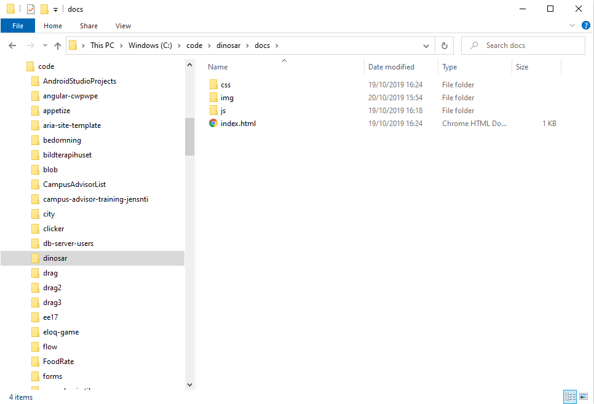

# Länkar

Länkar är en stor del av webben och är en av de delar som gör webben till webben. Hypertext dokument kan innehålla hyperlänkar som länkar samma flera dokument eller resurser. Nästan alla webbplatser har en eller flera länkar. När en länk klickas så aktiveras den i webbläsaren och skickar användaren vidare till en annan adress\(Uniform Resource Locator, **URL**\).

Länkar kan leda till sidor eller resurser på den webbplatsen eller till andra sidor. Länkar kan även peka på filer av olika slag, kan de inte visas av webbläsaren så får du en fråga vad du vill ska ske med filen.

## Länk-elementet

Länk elementet skrivs med `<a>`. För att länken ska fungera krävs det att länken har ett mål, det skrivs med attributet `href`.



```markup
<p>För att läsa mer om a-elementet så kan du besöka 
<a href="https://developer.mozilla.org/en-US/docs/Web/HTML/Element/a"
  title="Läs mer om a-elementet">MDN</a>
.</p>
```



Länk elementet är ett bra exempel på hur ett attribut samspelar med text-innehållet för elementet. I öppningstaggen så skrivs `href` attributet med den länk som ska öppnas när texten MDN klickas. Texten skrivs efter öppningstaggen och innan stängningstaggen.

Denna länk blir inline i `<p>` elementets text.

### Block-länkar

Hela element kan även användas som länkar, ett bra exempel för det är bilder som går att klicka. Då placeras block-elementet inuti a-elementet istället för text.



```markup
<a href="https://www.github.com">
  
</a>
```



## Att länka mellan dokument

När du skapar länkar på din webbplats är det viktigt att du förstår hur du länkar mellan dokument. Du behöver förstå hur du anger **sökvägen**\(engelska **path**\). En URL använder sökvägen för att hitta filer i ett filsystem. 



För att komma åt filer så används **relativa** sökvägar på webben. Det betyder att du utgår från dokumentet och vars det ligger i filstrukturen. Ofta utgår en sidan från index.html.


Använd aldrig absoluta sökvägar till filer i ditt dokument. Börjar sökvägen med c:\... så kommer det inte fungera för någon annan.


### Länka i samma mapp

Du vill länka från index.html till about.html som ligger i samma mapp.



```markup
<a href="about.html">About</a>
```



### Länka till en undermapp

Du vill länka till en fil i en mapp som ligger i samma mapp. 



```markup
<a href="gallery/pictures.html">Mitt bildgalleri</a>
```



### Länka till en överliggande mapp

Ibland så behöver vi kunna gå upp i mappstrukturen för att komma åt filer som ligger i en annan mapp. Då används `../`



```markup
<p>Vill du ladda ned en pdf med mitt galleri? Klicka då
  <a href="../pdf/bildgalleri.pdf">här</a>.
</p>
```



### Länka i ett dokument

Vissa länkar används för att länka mellan sektioner i ett dokument, det kallas för fragment. För att göra det krävs det att ett element har ett `id` attribut och att länken pekar till det. Id markeras med \# .



```markup
<p>Klicka för att hoppa till <a href="#kapitel2">Kapitel 2</a>.</p>

<h1 id="kapitel2">Kapitel 2</h1>
```




Försök att alltid namnge dina filer och mappar med små bokstäver. Undvik även specialtecken\(åäö\) och mellanslag.


