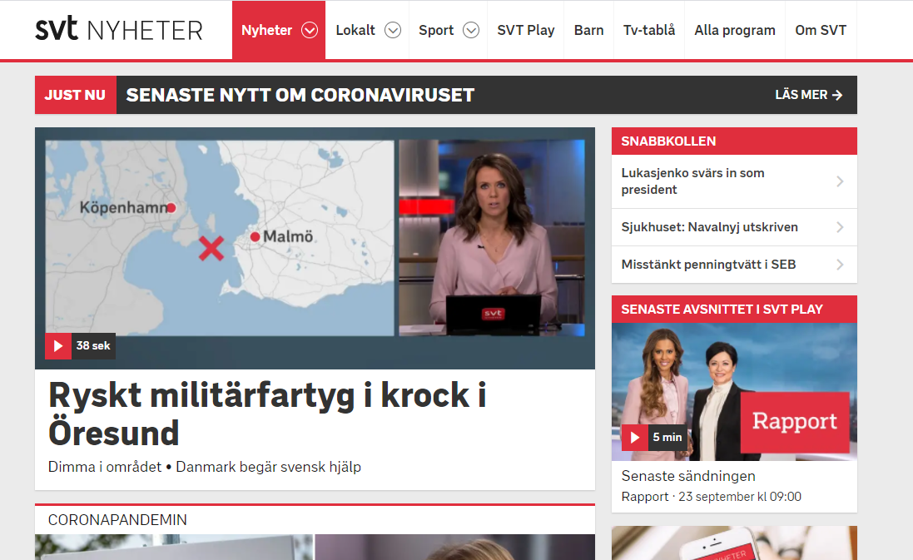

# Struktur

En webbsidas struktur används till att samla element och definiera dess områden. De flesta webbsidor ser någorlunda olika ut, men de innehåller nästan alla liknande komponenter. Det är viktigt och praktiskt att lära sig detta och att följa den strukturen.

Strukturen skapas med ett antal semantiska element. Det hjälper oss att ytterligare definiera dessa komponenter.

## Komponenter

Försök identifiera komponenterna på [SVT Nyheter](https://svt.se).



### Sidhuvud

Ett sidhuvud är en del av sidan som ofta följer med mellan webbplatsens olika sidor. Det kan vara en logotyp eller liknande. Logotypen bör vara en länk som tar användaren tillbaka tills startsidan. Ofta kombineras det med sidans navigation och då kan det vara så att enbart elementet för navigationen används. För ett sidhuvud så används elementet `<header>`.

### Navigation

I navigationen finns det oftast länkar till webbplatsens huvudsektioner. Länkarna i en navigation skrivs ofta som text, tabbar eller knappar. Det är viktigt att vara konsekvent i sidans navigation för att göra det så användbart som möjligt. Försök även om möjligt ge användaren en indikation på vilken sida som är den aktiva i navigationen. Elementet för navigationen är `<nav>`.

### Huvudinnehåll

Sidans huvudinnehåll samlas ofta under elementet `<main>`. Innehållet kommer att varierar från sida till sida. Elementet kan i sin tur vara uppdelat i ett antal sektioner. I innehållets sektioner kan vi i sin tur använda komponenter vid behov, som ett sidhuvud.

### Sidofält

Ofta finns det ytterligare information på en webbplats som behöver samlas. Ett sätt att göra det är att placera dem i ett sidofält. Det semantiska elementet för ett sidofält är `<aside>`. Ett sidofält kan vara placerat i sidans innehållstagg.

### Sidfot

Sist kommer en sidfot, oftast en rad längst ned på sidan där det samlas information om sidan. Kontaktuppgifter, copyright och så vidare. Elementet för en sidfot är `<footer>`.

## Koda en sidstruktur

Precis som att det finns en [grundmall ](untitled.md#ett-exempel)för ett HTML dokument så kan vi skapa en liknande grund för komponenterna. Här nedan följer en grund för SVT Nyheter utifrån [bilden](struktur.md#komponenter).


```markup
<!DOCTYPE html>
<html lang="en">
<head>
  <meta charset="UTF-8">
  <meta name="viewport" content="width=device-width, initial-scale=1.0">
  <title>SVT Nyheter</title>
</head>
<body>
  <nav>
    <a href="#">SVT NYHETER</a>
    <ul>
      <li><a href="#">Nyheter</a></li>
      <li><a href="#">Lokalt</a></li>
      <li><a href="#">Sport</a></li>
    </ul>
  </nav>
  <main>
    <header>
      <h1>JUST NU <span>SENASTE NYTT OM CORONAVIRUSET</span>
        <a href="#">LÄS MER</a>
      </h1>
    </header>
    <article>
      
      <h2>Ryskt militärfartyg i krock i Öresund</h2>
      <p>Dimma i området. Danmark begär svensk hjälp</p>
    </article>
    <article>
      
      <h2>Enmma Frans om stigande smittkurvan: "Ganska väntat"</h2>
      <p>Forskare: Stora frågan är om uppgången fortsätter</p>
    </article>
    <aside>
      <h3>SNABBKOLLEN</h3>
      <ul>
        <li><a href="#">Lukasjenko svärs in som president</a></li>
        <li><a href="#">Sjukhuset: Navalnyj utskriven</a></li>
      </ul>
    </aside>
  </main>
  <footer>
    <h4>SVT NYHETER</h4>
    <ul>
      <li>Tjänstgörande webbredaktör: <a href="#">Person Personsson</a></li>
      <li><a href="mailto:svt">Kontakta SVT Nyheter</a></li>
      <li>&copy; Sveriges Television AB</li>
    </ul>
  </footer>
</body>
</html>
```


Koden här ovan är inte komplett och vissa attribut har utelämnats för att förenkla, men strukturen finns där. Notera att sidan inte har en `<header>`, istället tjänar sidans navigation som ett sidhuvud. Sidans huvudinnehåll börjar med en `<header>` för att ge fokus till viktiga nyheter. Varje nyhet använder sedan elementet `<article>`.


Kopiera koden och kör den i webbläsaren, det du kommer se är att sidan saknar design. Det du ser är enbart standardformateringen av HTML.


### Olika element för innehåll

Försök att strukturera din kod med hjälp av semantiska element där det är möjligt eftersom det underlättar för tillgängligheten. Men det finns även många tillfällen där det inte är möjligt. Du kommer även att behöva dela upp dig kod i nästlade element.

För att dela upp innehåll kan [artikel-elementet](https://developer.mozilla.org/en-US/docs/Web/HTML/Element/article) användas som i exemplet. Ett annat element med semantisk betydelse är &lt;section&gt;,  vilket representerar en sektion av en helhet\(vilket kan vara en artikel\), läs mer [här](https://developer.mozilla.org/en-US/docs/Web/HTML/Element/section). Det kan vara svårt att välja element för sitt innehåll och därför finns det även ett generiskt element för innehåll, det heter `<div>`. En `<div>` har ingen semantisk mening och bör enbart användas när en semantisk mening saknas. Läs mer om div-elementet [här](https://developer.mozilla.org/en-US/docs/Web/HTML/Element/section).

## Övning

1. Öppna filen index.html som du skapade i kapitlet om [text](text.md#oevning).
2. Strukturera upp din tidigare kod. Använd dig av.
   1. Sidhuvud, bokens titel.
   2. Navigation, kapitel.
   3. Innehåll för bokens text.
      1. Du kan dela upp varje kapitel med taggen `<section>`
   4. Sidfot med länk till [e-boken](https://www.gutenberg.org/files/345/345-h/345-h.htm).
3. Lägg till en bild.

