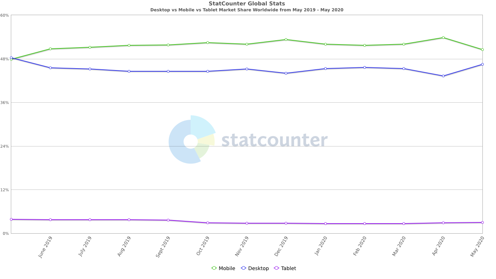
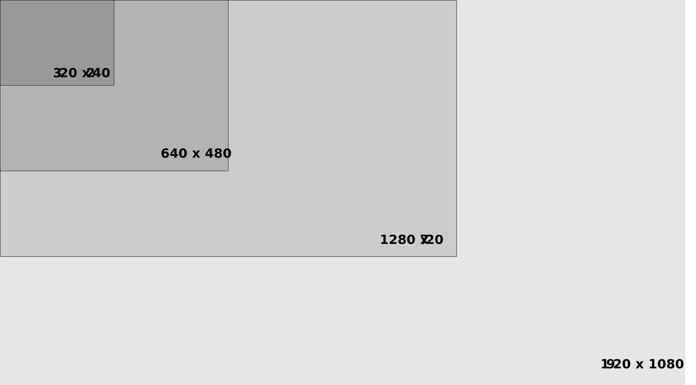

# Bilder

> Bilder och media med alternativa format, optimering och tillgänglighet.

## Skärmupplösning

En dators skärm har en [skärmupplösning](https://sv.wikipedia.org/wiki/Sk%C3%A4rmuppl%C3%B6sning) och ett **bildförhållande**. Du känner säkert till skärmupplösningen 1920 x 1080 och kanske att det är bildförhållandet 16:9. Det är viktigt att känna till då webbsidor används på många olika **enheter** \(**devices**\). Varje enhet har en skärm med tillhörande upplösning och bildförhållande.

På grund av tekniska begränsningar användes webben enbart från stationära datorer \(desktop\) tidigare men i takt med att tekniken utvecklats är nu mobila-enheter minst lika vanliga.

## 

#### Vilken upplösning är vanligast?

Statistik från [statcounter](https://gs.statcounter.com/):

* [Stationär \(desktop\)](https://gs.statcounter.com/screen-resolution-stats/desktop/worldwide).
* [Mobiltelefon](https://gs.statcounter.com/screen-resolution-stats/mobile/worldwide).

Upplösningen 1366 x 768 är fortfarande vanligast på stationära datorer, tätt följt av 1920 x 1080. Av denna anledning är det viktigt att testa olika upplösningar vid skapandet av en webbsida. 1366 x 768 har bildförhållandet 16:9 så formatet är densamma som för 1920 x 1080.


Även om användaren har en hög skärmupplösning, blir få gränssnitt bra med en fullskräms-bredd på 1920 pixlar.


## Bildstorlek

### Dimension

Alla bilder som är sparade på en dator har en **bredd** och en **höjd**. Det är vanligt att prata om en bilds **upplösning** \(engelska **resolution**\) men det är något [annat](bilder.md#upploesning). Dimensionerna på en bild kan till exempel vara 320 bred och 240 hög \(skrivs 320 x 240\). Att en bild är 320 bred betyder att den är 320 **pixlar** bred. Pixlar är små fyrkanter som innehåller färginformation.


Bilder du använder på webbsidan ska sparas med samma bredd och höjd som de visas med.


### Upplösning

Den faktiska [bildupplösningen](https://sv.wikipedia.org/wiki/Bilduppl%C3%B6sning) som en bild har mäts i antalet pixlar som bilden har, då används måtten **Pixels Per Inch** \(**PPI**\) eller **Dots Per Inch** \(**DPI**\). Måttet DPI används för tryck \(utskrift\) och då är det viktigt att bilden har åtminstone **300 DPI** för att bilden ska bli skarp. På skärmar fungerar det annorlunda och en måttstock är att använda **72 PPI** för digitala bilder.


Att använda 72 PPI för digitala bilder begränsar bildens filstorlek.


### Fil

Alla filer på en dator har en storlek, vilket mäts i bytes. När bilder används på en webbsida så blir det en del av en helhet som måste skickas till användarens enhet. Detta tar bandbredd och påverkar hur snabbt sidan visas. Av den anledning så är det viktigt att begränsa storleken på alla filer.

Bilder är något som kan och ofta tar stor plats, därför är det viktigt att begränsa bildernas filstorlek. Något som spelar stor roll för detta är bildens [format](bilder.md#bildformat).

## Bildformat

Det finns ett stort antal digitala **bildformat**. Några lämpar sig speciellt väl för webben.

#### Komprimering

Digitala bilder använder i nästan alla fall någon form av [komprimering](https://sv.wikipedia.org/wiki/Datakompression). Komprimeringen hjälper till att begränsa bildens filstorlek. Det finns två typer av komprimering för bilder, **icke-destruktiv**- och **destruktiv** komprimering. En icke-destruktiv komprimering är begränsad då den arbetar på ett sådant sätt att data inte ska förloras, till skillnad mot en destruktiv komprimering där data förloras.

### Portable Network Graphics \(PNG\)

PNG utvecklades för att ersätta GIF-formatet. PNG är ett format som använder icke-destruktiv komprimering. PNG lämpar sig väl för grafiska element, men stora enfärgade områden. PNG kan fungera på fotografier, men kan inte mäta sig med JPEG när det kommer till filstorlek.

### Joint Photographic Experts Group \(JPEG\)

JPEG eller ofta JPG \(eftersom filändelser ofta är begränsade till tre tecken\) är ett bildformat med destruktiv komprimering. För fotografier kan JPEG ge en väldigt bra kompressionsgrad. JPEG lämpar sig dock mindre bra för bilder som innehåller text eller raka linjer.


Undvik att arbeta i JPEG när du redigerar bilder; varje gång du sparar i JPEG-formatet försämras kvalitén.


### Graphics Interchange Format \(GIF\)

GIF är en äldre bildstandard som funnits med länge på webben. Likt PNG lämpar sig GIF bäst för grafiska element. GIF bör dock undvikas för fotografier. GIF kan animeras.

### Scalable Vector Graphics \(SVG\)

SVG är ett **vektorgrafik**-format. Vektorgrafik är baserat på koordinater och SVG sparas i språket [**XML**](https://sv.wikipedia.org/wiki/XML). Det gör att vektorgrafik aldrig förlorar i kvalité när bilden skalas upp; det gör att SVG lämpar sig otroligt väl för ikoner och element som innehåller text, till exempel logotyper. Vektorgrafik fungerar inte alls för fotografier.


SVG använder CSS för bland annat färg och typsnitt.


### Webbformat

Det finns ett antal nya experimentella bildformat som används på webben. De optimerar bilder i väldigt hög grad, men de stöds ännu inte av alla webbläsare. När dessa format används är det viktigt att kontrollera i vilka webbläsare det fungerar och erbjuda alternativ.


Använd experimentella format med försiktighet.


## Optimering

Automatiserad optimering vs manuell.

