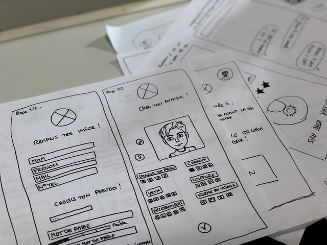

# Skisser

## Varför

Att använda papper och penna för att skapa ett par skisser över din design är snabbt och effektivt. Det är dessutom väldigt lätt att dela med dig av dina idéer på detta sätt.

Papper kan med fördel användas i ett första stadium, innan processen fortsätter i ett digitalt verktyg.

## Hur

Rita är det förenklade svaret. En pappers-prototyp är som oftast en skiss över det som ska beskrivas, webbsidans eller applikationens layout i form av en **wireframe**. En wireframe är en enkel skiss som visar de viktigaste elementen. Det kan illustreras med block eller i högre detaljrikedom, baserat på tid och behov. 

Att ta fram en prototyp är en iterativt process, skapandet och arbetet med skissen går fram och tillbaka, nya idéer och förändringar får plats i arbetet och här utnyttjas pappersmediets stora fördel. Det går snabbat att skapa och ändra.

## Komplexitet

Prototypens komplexitet är något som går utmärkt att iterera över i processen. Börja med att skapa en wireframe. Utöka den sedan med innehåll, introducera färger, typsnitt och andra delar som visualiserar sidans faktiska design.

För animationer, fler sidor eller rörliga delar så använd mer papper, Post-it, färgpennor, tejp och så vidare.

## Övningar

Du behöver, papper penna och en källa. 

1. Surfa till existerande webbplatser, antingen på en dator eller en mobiltelefon.
2. Identifiera webbplatsens olika komponenter.
3. Skissa av dem på pappret.
   1. Skissa block för en wireframe.
   2. Utöka komplexiteten vid behov.

Vill du utöka övningen så skapa skisser som illustrerar navigationen, hur sidan fungerar.

