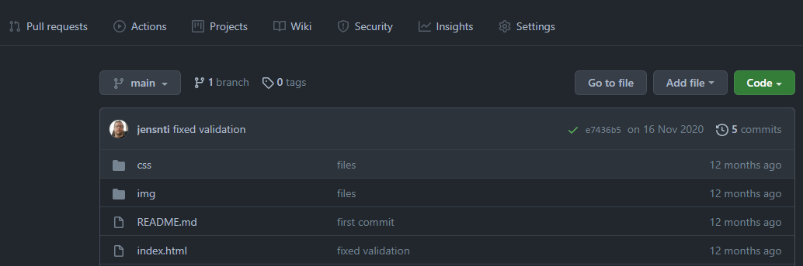
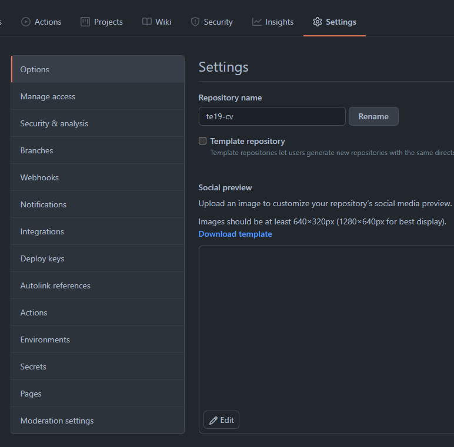
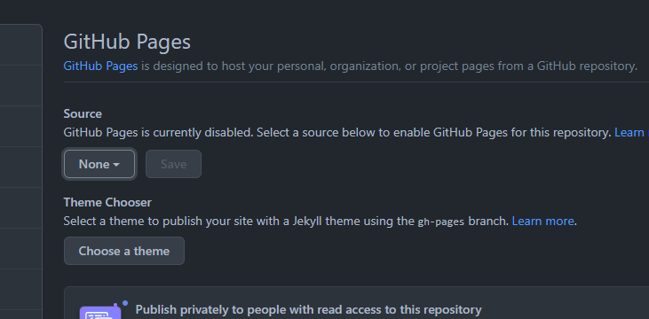
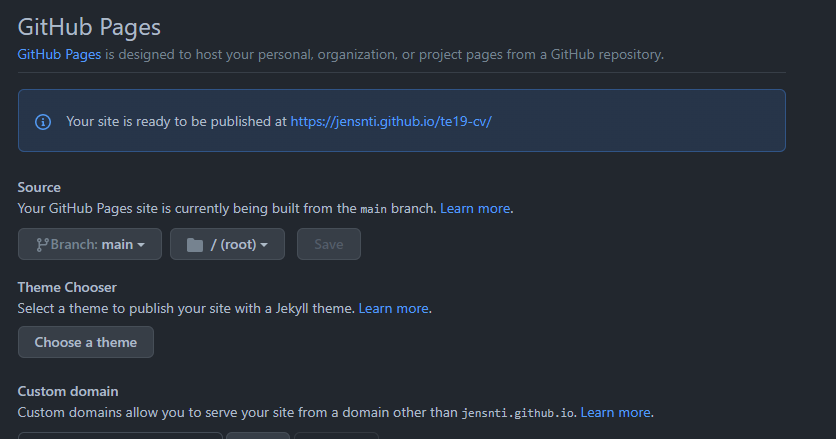

# Git pages

> Publikation av webbplatser med och utan webbpubliceringssystem.

GitHub erbjuder hosting för webbsidor med Pages. För att slå på Pages för ett repository så behöver du göra följande.

1. Klicka Settings
2. Klicka Pages
3. Välj den branch som ska hostas, main
4. Välj root som din webbroot, förslagsvis där din index.html finns

