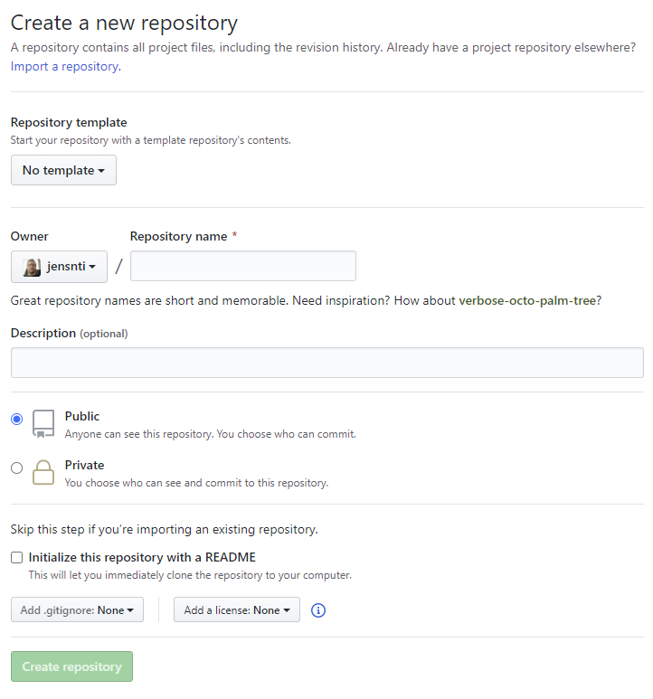
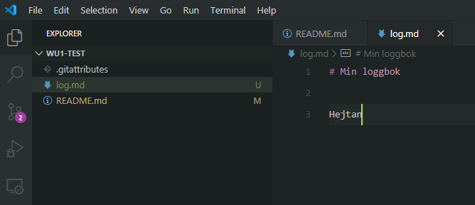

# Git commandline

## Installera Git cmd

För cmd-versionen så laddar du antingen ned [Git portable](https://git-scm.com/download/win), eller kör [WSL](https://jens-andreasson.gitbook.io/webbserverprogrammering/utvecklarmiljo/wsl). Detta är alltså inte en GitHub klient på samma sätt som GitHubs desktop-klient.


Ladda ned 64-bit Git portable for Windows, [https://git-scm.com/download/win](https://git-scm.com/download/win).



Ett _portable _program är ett program utan installationsfiler. Du laddar ned det, packar(oftast) upp det och sedan kan du köra programmet.


**PortableGit** är en **körbar** (**executable, exe**) fil som låter dig packa upp de filer du behöver. Kör programmet och välj att spara filerna under `c:\tools\portablegit`.

Windows behöver kunna hitta program för att kunna köra dem från cmd (till exempel **Powershell**). För det används systemets **PATH**, en global sökväg som går att redigera. För att lägga till ett program i PATH:

1. Starta **Utforskaren** (**Explorer**) win+e.
2. Högerklicka på **Den här datorn**, välj **Egenskaper.**
3. Öppna **System och säkerhet, System**
   &#x20;i **Kontrollpanelen.**
4. Välj **Avancerade systeminställningar
   .**
5. Klicka på **Miljövariabler
   .**
6. Välj **Användarvariabler** för din användare.
7. Dubbelklicka på PATH.
8. Välj **Ny** och skriv in **sökvägen** c:\tools\PortableGit\bin
   .
   1. Byt sökväg om du installerar andra program.
9. Starta Powershell
   .
10. Kör git, du kommer att se programmets hjälp.
11. Klart.


Efter ändringar i PATH måste cmd-program startas om för att ändringarna ska gälla.


### Kommandon

Det är bra att ha kunskapr kring hur Git fungerar i cmd. Det här avsnittet repeterar hur du löser en konflikt med Git i cmd.


Skapa en code mapp om du inte har gjort det


Använd sedan en terminal (Powershell, cmd, [WSL](https://jens-andreasson.gitbook.io/webbserverprogrammering/utvecklarmiljo/wsl)) för att skapa en mapp för ditt repo.


Använd samma namn på mappen för repot som repots namn




```bash
c:
cd \
md code # md är make directory, så använd bara om du inte skapat med Utforskaren
cd code
md wu1-test
cd wu1-test
```




För att lista innehållet (i en mapp) eller se var i en filstruktur du befinner dig kan du i cmd skriva **dir** (Windows) eller **ls** (Linux).


Skapa sedan ett nytt repo på GitHub, gör det genom att [repetera de här stegen](git.md#ditt-foersta-repository), ge repot namnet **wu1-test**.



Klicka **Create repository** för att skapa repot. Då kommer **Quick setup** att visas.


Om du markerat "Intialize this repository with a README" så kommer inte Quick setup instruktionerna visas.



Quick setup är en lista över de kommandon som behöver köras för att slutföra skapandet av repot. Det skapar även en README-fil. **Om du kopierar Quick setup-koden, var noga med att köra den från rätt mapp!**



```bash
cd c:\code\wu1-test

echo "# wu1-test" >> README.md
git init
git add README.md
git commit -m "first commit"
git remote add origin https://github.com/jensnti/wu1-test.git
git push -u origin master
```



1. echo skriver ut text och med >> så pipar (skickas informationen, engelska **pipe**) det texten till en fil. Det skapar filen README.md.
2. git init, initialiserar mappen som ett git repo.
3. git add _filnamn _lägger till en eller flera filer till repot.
4. git commit -m "meddelande", skapar en commit med ett namn.
5. git remote add origin _github url_, detta kopplar samman git repot med remote origin på GitHub.
6. git push, skickar repots commits till GitHub.


Github training, Init, [https://youtu.be/WxMFZncm12s](https://youtu.be/WxMFZncm12s)


Om du kört kommandona ovan så har du initierat repot och skapat readme filen. Hade du för bråttom och klistrade in det i c:, leta upp mappen .git i utforskaren och ta bort den. Börja sedan om.

Nästa steg är att redigera en fil och ladda upp det på GitHub.

Starta vscode från cmd genom att skriva.



```bash
code .
```



Öppna filen README.md och redigera den. Använd sedan terminalen igen för att skapa en commit och skicka den till remote.



```bash
git add README.md
git commit -m "Uppdaterade README"
git push
```




Var noga med att läsa vad det står i terminalen, försök lösa eventuella fel


Första gången du commitar från cmd så behöver du ange dina användaruppgifter.



```bash
git config user.name "Your Git Username"
git config user.email "your@address.com"
```



Upprepa sedan kommandona för att skapa en commit och skicka den till remote.



```bash
c:\code\wu1-test>git push
Counting objects: 39, done.
Delta compression using up to 8 threads.
Compressing objects: 100% (28/28), done.
Writing objects: 100% (39/39), 5.44 KiB | 928.00 KiB/s, done.
Total 39 (delta 2), reused 0 (delta 0)
remote: Resolving deltas: 100% (2/2), done.
To https://github.com/jensnti/wu1-test.git
 * [new branch]      master -> master
```



### Problem och att lösa dem från cmd

Konflikter kan ske oavsett vilken typ av Git-klient du använder. Precis som i tidigare [avsnitt ](git.md#problem-och-att-loesa-dem)ska du nu få lösa en konflikt, den här gången från cmd.

Synkronisera först ditt lokala repo mot remote.



```bash
git fetch
git pull
```



Öppna repot på GitHub.com. Redigera README.md och commita dina ändringar..


Öppna vscode och redigera README-filen. Sparan ändringarna och skapa en ny commit.



```bash
git add README.md
git commit -m"uppdatering av readme"
git push
```



Att pusha filerna resulterar i en konflikt (merge issue). Felmeddelandet ser ut ungefär såhär.

```bash
To https://github.com/jensnti/wu1-test.git
 ! [rejected]        master -> master (non-fast-forward)
error: failed to push some refs to 'https://github.com/jensnti/wu1-test.git'
hint: Updates were rejected because the tip of your current branch is behind
hint: its remote counterpart. Integrate the remote changes (e.g.
hint: 'git pull ...') before pushing again.
hint: See the 'Note about fast-forwards' in 'git push --help' for details.
```

Push misslyckades. Var noga med att läsa hela meddelandet, då Git ger tips om hur felet ska lösas.

Kör git pull för att initiera arbetet med att lösa konflikten.



```bash
git pull
```



Eftersom filerna i det lokala repot skiljer sig från filerna på remote kan inte Git automatisk slå ihop dem. Du behöver ange vad, eller vilken version som ska sparas.

```bash
Auto-merging README.md
CONFLICT (content): Merge conflict in README.md
Automatic merge failed; fix conflicts and then commit the result.
```

Använd sedan vscode för att öppna de filer som har konflikter. Vscode hjälper dig att redigera dem och välja vad som ska sparas.


Spara sedan ändringarna; skapa en ny commit och pusha.



```bash
git add README.md
git commit -m"fixade konflikter"
git push
```



## Branches

**Branches** (svenska, grenar) är ett sätt att arbeta med Git. Namnet kommer från den trädstruktur som Git har. Den här guiden visar hur du arbetar med branches i Git cmd.

> &#x20;**Branching** is the way to work on different versions of a repository at one time.

Som standard har alla repos en branch som heter **main**. Hittils har allt arbete du gjort skett i main. Det är något som generellt bör undvikas av olika skäl. Att arbeta i main kan leda till säkerhetsproblem, dataförlust och annat.


Github training, Branch, [https://youtu.be/H5GJfcp3p4Q](https://youtu.be/H5GJfcp3p4Q).


#### Skapa en ny branch

Kontrollera att du är i rätt mapp. Fortsätt från det tidigare [test-repot](git.md#git-command-line).

```bash
cd \code
cd wu1-test
git branch feature
git checkout feature
```

Kommandot git branch skapar en ny branch. Git branch följs av namnet på den branch som ska skapas. Git checkout följt av namnet på den branch som ska användas byter branch. Namnet på branchen i det här fallet är feature. Den branch som är vald blir **active** (svenska, **aktiv**).


GitHub training, Checkout, [https://youtu.be/HwrPhOp6-aM](https://youtu.be/HwrPhOp6-aM).




```bash
git branch
# Vilket ger oss en lista av de branches som finns och * för den aktiva
* feature
  main

```





Kontrollera alltid att du arbetar i rätt branch.


Med branchen feature aktiv. Skapa en ny fil med namnet log.md.



När arbetet med en branch är färdigt så behöver det commitas och sedan slås ihop (**merge**) med master. Det kan göras på två sätt. Allt kan antingen slås ihop lokalt för att sedan pusha det till master. Eller så utförs det på GitHub med en pull request. Det första alternativet fungerar när du arbetar själv på ett projekt, i alla andra fall är det senare att föredra.&#x20;

Instruktionerna som följer visar hur du slår ihop dina branches lokalt. För att skapa en pull request, läs Githubs guide [här](https://guides.github.com/activities/hello-world/).



```bash
git branch # kontrollera aktiv branch
git add . # . betyder, lägg till alla filer i mappen
git commit -m "ny fil i ny branch"
```



Kontrollera vilka filer som finns  i mappen med dir eller ls. Byt sedan branch och kontrollera igen.

För att slå ihop branches väljer du först den branch som ska ta emot koden från en branch. Från den aktiva branchen körs kommandot git merge, med namnet på den branch som ska slås ihop till den aktiva.



```bash
git checkout main
git merge feature
```



Om konflikter uppstår så läs felmeddelande och försöka att lösa dem som tidigare.


GitHub training, Merge, [https://youtu.be/yyLiplDQtf0](https://youtu.be/yyLiplDQtf0).


Efter att de slagits ihop så tar du bort den branch som inte längre används.



```bash
git branch -d feature
```



Att arbeta med branches är GitHubs workflow, läs mer om det i GitHubs material för att få en bättre förståelse för hur det fungerar.
