# Git

## GitHub

[Git](https://git-scm.com/) är ett versions-hanteringssystem för projekt och [GitHub](https://github.com/) är ett webbhotell\(enkelt uttryckt\) för Git-projekt.

### Varför?

Vi använder GitHub i alla programmeringskurserna på skolan. Anledningen till att vi gör det är att vi dels kan få en bra överblick över din progression genom uppgiften. Men det ger oss även viss dokumentation av ditt arbete samt en samlad plattform där vi sköter inlämningar.

Jag som lärare kan även enkelt dela kod till er och ni kan använda den.

GitHub ger även utmärkta möjligheter till samarbete och att lära av varandra. Det är även ett välkänt och väldigt ofta förekommande verktyg i arbetslivet.

Vi kommer även att använda oss av GitHub classroom.


 Har du registrerat ett konto på [GitHub](https://github.com/)?


### Installation

GitHub kommer som en desktop applikation och som ett cmdline verktyg. För desktop klienten så laddar du ned programmet och kör installationsfilen.


Ladda ned och installera desktop klienten, [https://desktop.github.com/](https://desktop.github.com/)


#### Om du vill installera cmdline Git

För cmdline versionen så laddar du antingen ned [Git portable](https://git-scm.com/download/win), eller kör [WSL](https://jens-andreasson.gitbook.io/webbserverprogrammering/utvecklarmiljo/wsl). Detta är alltså inte en GitHub klient på samma sätt som GitHubs desktop applikation.


Ladda ned 64-bit Git portable for Windows, [https://git-scm.com/download/win](https://git-scm.com/download/win)



Ett _portable_ program är ett program utan installationsfiler. Du laddar ned det, packar\(oftast\) upp det och sedan kan du köra programmet


PortableGit är en .exe fil som packar upp sina filer där du väljer att spara dem. Kör det och välj att spara filerna under `c:\tools\portablegit`.

För att sedan kunna använda Git från cmdline behöver vi lägga till det i ditt systems PATH variabel, detta så att systemet kan hitta programmet.

* [ ] Starta Utforskaren\(Explorer\), `win+E`
* [ ] Högerklicka på den här datorn, välj Egenskaper.
* [ ] Du får nu upp Kontrollpanelen, System och säkerhet, System
* [ ] Välj Avancerade systeminställningar
* [ ] Klicka på Miljövariabler
* [ ] Under Användarvariabler för din användare, så letar du upp och dubbelklickar på Path
* [ ] Välj Ny och skriv in sökvägen till `\bin` mappen i Git katalogen. Det bör vara, `C:\tools\PortableGit\bin`
* [ ] Starta Powershell \(eller starta om det om du hade det igång\)
* [ ] Skriv kommandot `git`, funkar det så bör få en lista över tillgängliga kommandon för programmet
* [ ] Klart, fira!

### Ditt första repository


Tips: Kör igenom desktop klientens tutorial om detta är helt nytt


Ett repository, eller repo, är en sida på GitHub där alla dina filer till projektet är samlade\(tillsammans med massa annat\). På github.com så har det en url som följer samma mönster.


github.com/username/repository-namn


För att skapa ett nytt repo med desktop klienten så kan vi klicka på **+ Create a New...** och följer instruktionerna.


Alternativt så gör vi detta på webbplatsen, men då behöver du välja "Add an Existing..." i desktop klienten för att koppla ihop dem.

* [ ] Surfa till [https://github.com/](https://github.com/)
* [ ] Logga in
* [ ] Klicka på + i menyn och välj, New repository
* [ ] Skriv in ett namn
* [ ] Klicka på att skapa

## Att använda Github

Git är ett versionshanteringssystem, med det menas att det håller reda på dina filer och innehållet i dem. Detta sker lokalt med git, men när vi använder GitHub så kan vi synka det med filer som sparas på deras tjänst. Vi ska nu testa detta.


Att ha ett centralt ställe på din dator där du sparar allt arbetet med kod är god praxis


Först ska vi se till att vi har en mapp där vi kan spara allt arbete med kod på din dators hårddisk. Öppna Utforskaren\(Explorer\) i Windows och skapa en ny mapp\(Folder\) i c:\

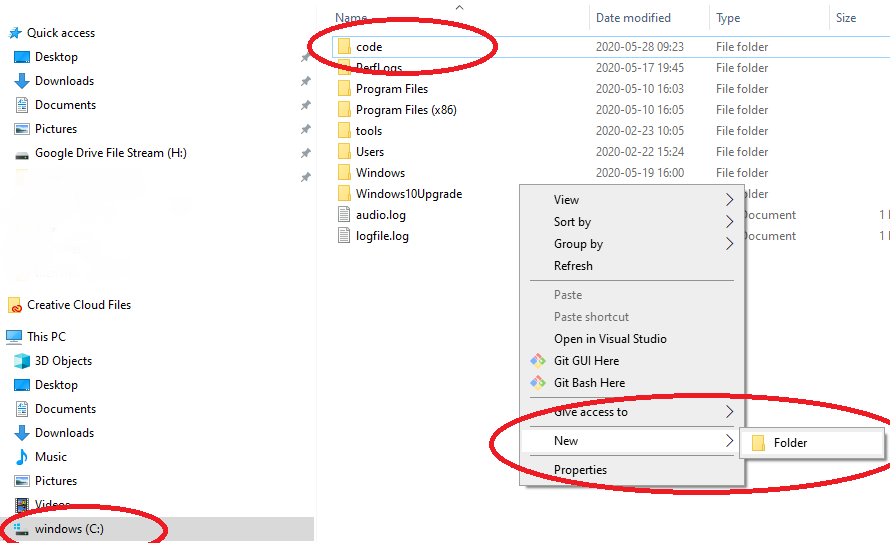

Bra, nu kan vi komma igång. [Klicka här om du vill hoppa till avsnittet för cmdline](git.md#git-cmdline).

### Github desktop


Här förutsätts det att du har kört igenom desktop klientens tutorial


Först så ska vi skapa ett repo att använda.

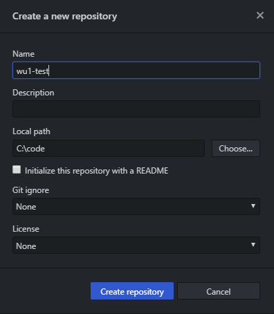

När det är klart så kan du sedan välja att publicera detta till Github, det kommer då att skapas ett repo på Githubs webbsida som kopplas till din lokala mapp.

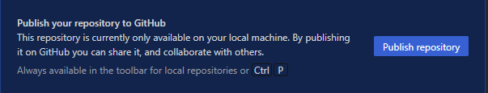

Vi är nu redo att börja arbeta. Förslagsvis öppnar du nu ditt repo med Visual Studio Code. Använd antingen knappen eller i code så väljer du Open Folder i File menyn.

I code så skapar du sedan en ny fil. I filen skriver du det som följer och sparar det sedan som `README.md`

```bash
# Hallå världen
Hej
```

I alla repon bör det finnas en `README.md` fil, detta är en den fil som GitHub automatiskt visar för repot och den är skriven i [Markdown](https://guides.github.com/features/mastering-markdown/).

Nu när vi har ändringar i filen så kan vi hoppa över till klienten igen. Vi ser där en lista över våra ändringar.  Klicka sedan Commit to master och efter det Push origin. Du har nu laddat upp dina lokala ändringar till GitHub.


Här förutsätts det att du inte har gjort några ändringar på github.com, du kommer annars få konflikter


### Problem och att lösa dem

Som tidigare nämnt så är Git ett versionshanteringssystem, detta kan leda till att det blir konflikter mellan dina lokala filer och de som finns sparade på GitHub. Git måste bestämma vilken version av filen som ska användas och vad den ska innehålla. För att lära oss hantera detta så ska vi skapa en sådan konflikt.

Börja med att surfa till ditt repo på github.com. Där väljer du sedan att redigare din README.md fil. Gör en ändring och välj Commit changes.

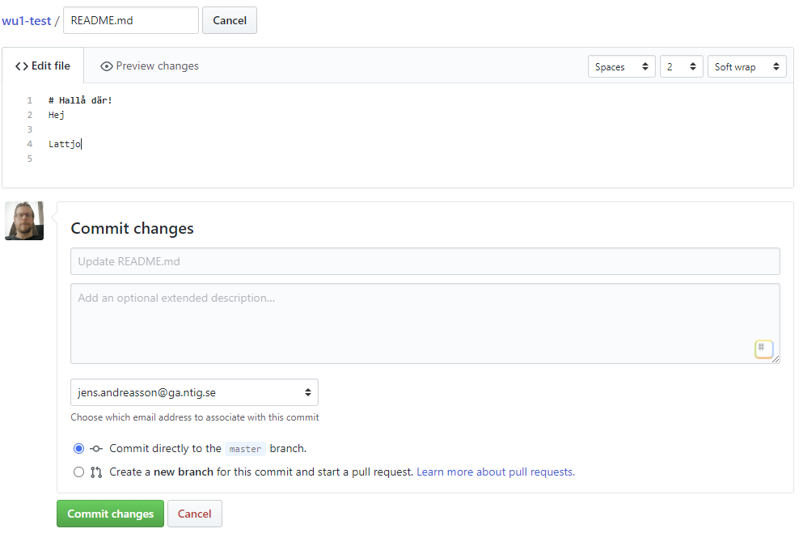


Det finns nu ett sätt att undvika problem och det är att göra Fetch origin följt av Pull origin. Då hämtar du och laddar ned ändringarna som gjorts på GitHub. Gör du detta innan du börjat arbeta så kommer du inte att få någon konflikt, eller merge issue


Om vi inte har haft framförhållningen att köra Fetch så måste vi då kunna lösa problemet. Det gör vi som följer. Se nu till att du har ändringar på origin som du inte har lokalt. Gå sedan in i code och gör ändringar.


```bash
# Hallå där!
Hej

Detta är ändringar som inte finns på origin och origin har ändrats!
```


Öppna sedan klienten och välj Commit to master. Du kommer då att få en varning om att du behöver hämta origin. 

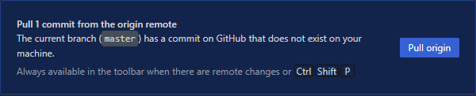

Detta kommer leda till en konflikt som behöver lösas innan vi kan slå ihop de ändringar vi har gjort.

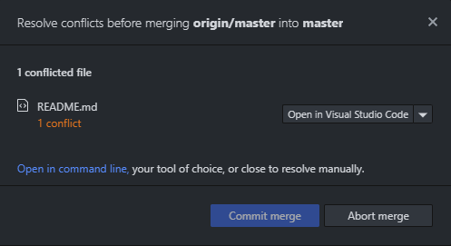

Det du nu behöver göra är att öppna filen i code. Detta för att lösa denna konflikt. I code så kommer då de ändringar som gjorts visas. Du behöver välja vilka ändringar i filen du ska spara. Välj och spara sedan filen.

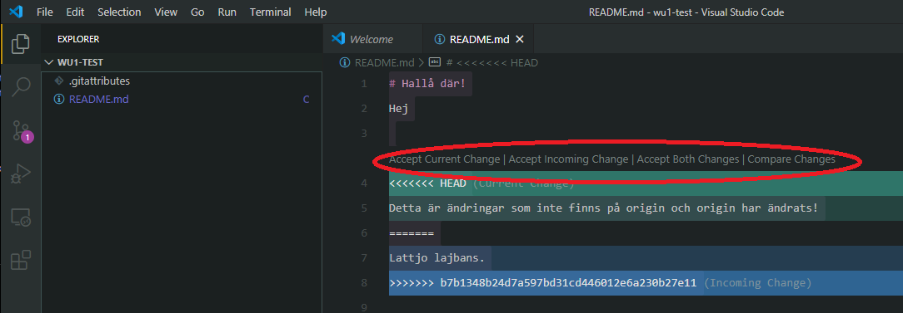

Konfliktdialogen i klienten kommer sedan uppdateras när du sparat filen, löst konflikten och du kan nu commita dina ändringar. Avsluta sedan med att pusha.

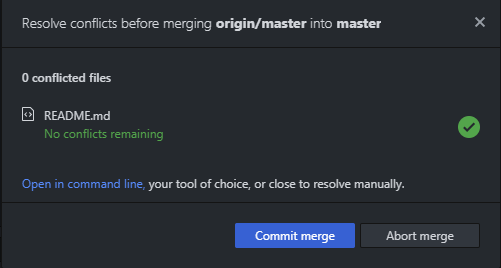

Det är inte alltid så här lätt att lösa konflikter mot GitHub, men detta är grundprincipen.


Du kan även använda code för att jobba mot GitHub. Du hittar mer om det i Source Control tabben


### Git cmdline

Att arbeta med de grafiska klienterna för att prata med GitHub funkar utmärkt, men det är väldigt bra att ha koll på hur det fungerar med cmdline verktygen också. Här följer instruktioner för hur vi skapar ett repo och löser en konflikt i cmdline klienten.


Skapa en code mapp om du inte har gjort det


Vi använder sedan `cmd`, `windows terminal`, `ubuntu`, `wsl` eller liknande för att skapa en mapp för repot.

```bash
# I Windows cmdline skriver du
c:
cd \
md code # md är make directory, så använd bara om du inte skapat med Utforskaren
cd code
md wu1-test
cd wu1-test
```


Du kan närsomhelst i cmdline skriva dir eller ls för att se vars i mappstrukturen du är. Notera även att i prompten så står det längst till vänster "vars du är"


När du nu har mappen skapad så behöver vi skapa repot på GitHub, gör det genom att repetera stegen som står här [ovan](git.md#ditt-foersta-repository), men döp repot till wu1-test.


Det är generellt en bra ide att döpa mappen för sitt repo till repots namn


För att kunna fortsätta så behöver vi skapa ett repo på GitHubs webbplats, så surfa dit och välj Create new repository. Fyll sedan i formuläret och döpt det till wu1-test.

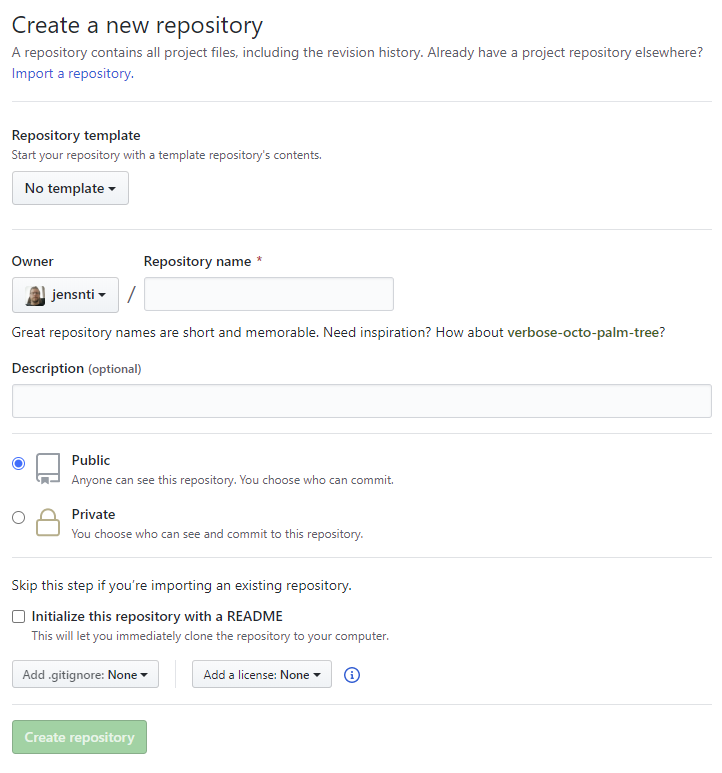

När du sedan klickat i att skapa det så kommer du att presenteras med en Quick setup för att koppla detta till din lokala dator.


Om du markerat Intialize this repository with a README så kommer du inte att få Quick setup instruktionerna.


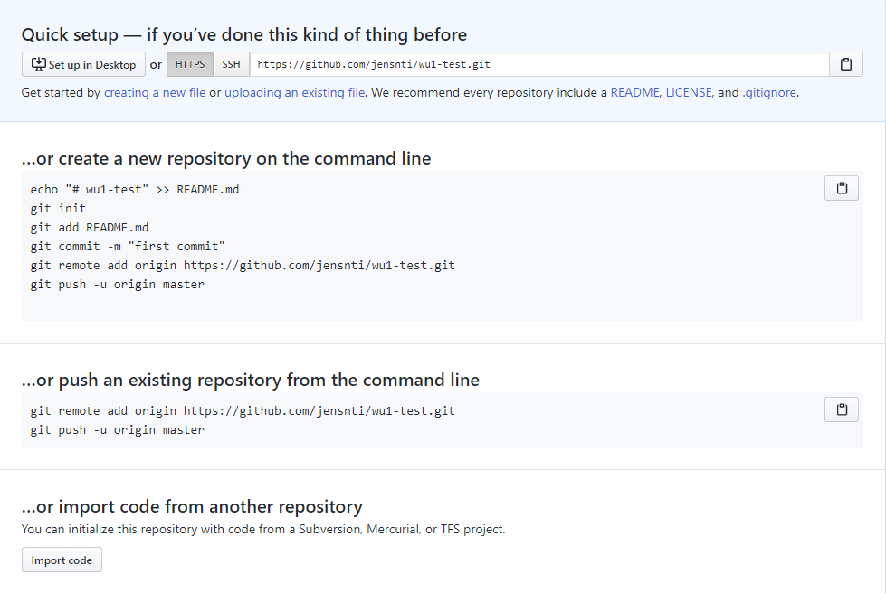

Här får du en lista över de kommandon som behöver köras lokalt i mappen för ditt git repo för att färdigställa allt. Värt att notera här är att det även skapar en README.md fil åt dig så att filen finns. Det är som följer.


Om du copy pasta detta, var noga med att alltid vara i rätt mapp!


```bash
cd c:\code\wu1-test

echo "# wu1-test" >> README.md
git init
git add README.md
git commit -m "first commit"
git remote add origin https://github.com/jensnti/wu1-test.git
git push -u origin master
```

1. echo skriver ett text meddelande och med &gt;&gt; så pipar det texten till en fil. README.md skapas
2. git init, initialiserar mappen som ett git repo
3. git add _filnamn_ lägger till en eller flera filer till repot
4. git commit -m "meddelande", skapar en commit med det meddelande du anger.
5. git remote add origin _github url_, detta kopplar samman git repot med remote origin på GitHub
6. git push, säger åt oss att skicka vår senaste commit till GitHub


Bortsett från att ladda upp README, så är det viktiga här att köra git init, git remote add.  
När detta är gjort kan du arbeta med filerna på det sätt du väljer.


Så om du har copy pastat kommandona ovan så har du initierat repot och skapat readme filen, bra. Om du hade för bråttom och klistrade in det i c:, leta upp mappen .git i utforskaren och ta bort den. Börja sedan om.

Vi ska nu redigera filen och ladda upp det på GitHub, innan vi provar att ställa till det och sedan lösa problemet.

I cmdline, i mappen du har öppen bör du kunna skriva `code .` för att starta code, notera punkten efter code, den säger att du ska öppna code i den nuvarande mappen. Redigera sedan README.md och spara.

Gå sedan tillbaka till ditt shell\(cmdline\) och kör följande.

```bash
git add README.md
git commit -m "Uppdaterade README"
git push
```

Det kommer förhoppningsvis stå något liknande detta, vilket betyder att det har fungerat. Om något annat har blivit fel så rekommenderar jag att du läser felmeddelanden och jobbar utifrån det.

Du kan här stöta på problem med att Git vill att du specifierar vem du är, du behöver då konfigurera detta och skriva det.

```bash
git config user.name "Your Git Username"
git config user.email "your@address.com"
```

När det är angett så bör du då kunna göra din commit och sedan pusha.

```bash
c:\code\wu1-test>git push
Counting objects: 39, done.
Delta compression using up to 8 threads.
Compressing objects: 100% (28/28), done.
Writing objects: 100% (39/39), 5.44 KiB | 928.00 KiB/s, done.
Total 39 (delta 2), reused 0 (delta 0)
remote: Resolving deltas: 100% (2/2), done.
To https://github.com/jensnti/wu1-test.git
 * [new branch]      master -> master
```

### Problem då?

Precis som i avsnittet med desktop klienten ska vi här titta på vad vi kan göra om vi får en merge issue när vi ska pusha till GitHub. Vi börjar med att se till att vi är synkade lokalt mot remote.

```bash
git fetch
git pull
```

Vi kan sedan surfa till repot på GitHub, där gör vi så en ändring i README.md och commitar den.


Vi ska sedan göra en lokal ändring i README.md, utan att först synka den med remote origin. Så öppna code och skriv mer i README.md.

```bash
git add README.md
git commit -m"uppdatering av readme"
git push
```

Eftersom våra repos inte är synkade så kommer vi nu att få en git merge, felmeddelandet ser ut ungefär såhär.

```bash
To https://github.com/jensnti/wu1-test.git
 ! [rejected]        master -> master (non-fast-forward)
error: failed to push some refs to 'https://github.com/jensnti/wu1-test.git'
hint: Updates were rejected because the tip of your current branch is behind
hint: its remote counterpart. Integrate the remote changes (e.g.
hint: 'git pull ...') before pushing again.
hint: See the 'Note about fast-forwards' in 'git push --help' for details.
```

Vi får då försöka lösa detta, vår push misslyckades och läser vi meddelandet så får vi en hint om vad som ska göras.

```bash
git pull
```

Vilket ger oss följande meddelande\(och har du code öppet så bör README.md visa merge meddelandet\).

```bash
Auto-merging README.md
CONFLICT (content): Merge conflict in README.md
Automatic merge failed; fix conflicts and then commit the result.
```

Enklast är nu att öppna code och redigera de dokument med konflikter som finns, precis som för klienten.


När du sedan sparat dina ändringar behöver du göra en ny commit och pusha.

```bash
git add README.md
git commit -m"fixade konflikter"
git push
```

Om alla konflikter är lösta och det fungerar så är det klart och löst.

## Branches

Tanken med Git är att vi ska arbeta med olika branches hela tiden. Den här guiden visar hur du gör med cmdline.

> **Branching** is the way to work on different versions of a repository at one time.

I övningarna ovan så har vi enbart arbetat med `master` branch och det är alltså något en ska försöka undvika. För att göra det så arbetar vi istället med andra branches än `master` och sedan slår vi ihop dem. Här nedan följer instruktioner för detta.

#### Skapa en ny branch

Se till att du är i rätt mapp, vi fortsätter från tidigare repo.

```bash
cd \code
cd wu1-test
git branch feature
git checkout feature
```

Här byter vi till rätt mapp, sedan kör vi två Git kommandon. `git branch feature`, skapar en ny branch med namnet feature och `git checkout feature` byter till den branchen. Feature är såklart det namn vi har valt på vår branch och du byter ut det till vad som passar.


Var noga med att du arbetar i rätt branch, kontrollera!


```bash
git branch
# Vilket ger oss en lista av de branches som finns och * för den aktiva
* feature
  master
```

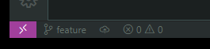

Så vi vet nu att vi arbetar i rätt branch, `feature`, så nu kan vi ändra på filerna i den. Skapa en ny fil i code och döp den till log.md.

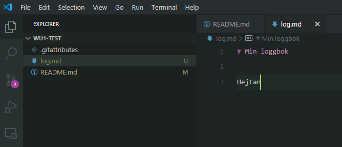

Låt oss säga att vi är nöjda med våra ändringar och att allting fungerar, vi vill nu commita detta till master. Det finns då två sätt att göra det på. Vi kan antingen slå ihop allt lokalt och sedan pusha master, eller så laddar vi upp vår branch till GitHub och skapar sedan en pull request. Det första alternativet fungerar rätt bra när vi själva arbetar på ett projekt, men om vi samarbetar med andra så bör vi absolut följa det senare alternativet. Jag kommer att visa det första alternativet här, för att kolla det senare, läs GitHubs guide som finns länkad [här](https://guides.github.com/activities/hello-world/) nedanför.

```bash
git branch # kolla vi är i feature
git add . # . betyder, lägg till alla filer i mappen
git commit -m"ny fil i ny branch"
```

Om vi nu kontrollerar filera i mappen, med `dir` eller `ls -la`, så ska vi se `log.md` filen. Byt nu till master branch och kontrollera filerna igen, `log.md` bör då inte synas. Vi kan nu slå ihop våra branches.

```bash
git checkout master
git merge feature
```

Med detta så bör våra ändringar ha slagits ihop mellan våra branches, får vi merge konflikter så kan vi lösa dem på samma sätt som tidigare. Slutligen så tar vi bort vår feature branch för den har tjänat sitt syfte.

```bash
git branch -d feature
```

Så nu har vi sett ett exempel på hur GitHubs workflow ser ut, se till att läsa på om detta i GitHubs egna guider för att få en bättre förståelse för hur det fungerar.

## Läs mer

* Cheat sheet, [https://github.github.com/training-kit/downloads/github-git-cheat-sheet.pdf](https://github.github.com/training-kit/downloads/github-git-cheat-sheet.pdf)
* Hello world på GitHub, [https://guides.github.com/activities/hello-world/](https://guides.github.com/activities/hello-world/)
* Understanding flow, [https://guides.github.com/introduction/flow/](https://guides.github.com/introduction/flow/)
* Pages, [https://guides.github.com/features/pages/](https://guides.github.com/features/pages/)
* [https://guides.github.com/](https://guides.github.com/)
* [https://help.github.com/en/github/getting-started-with-github](https://help.github.com/en/github/getting-started-with-github)


